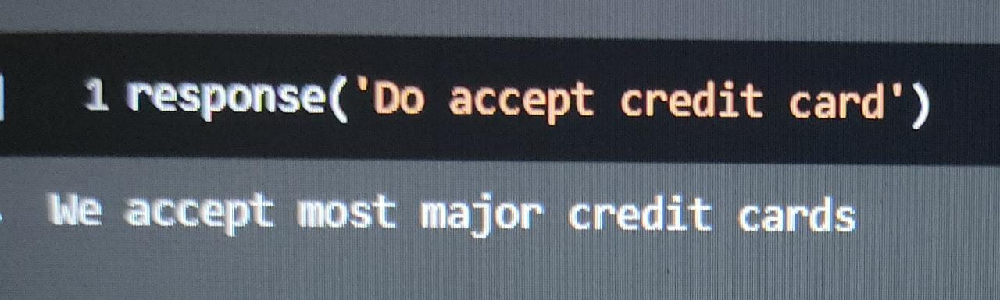

# Simple-Chatbot

## Language
Python

## Objective
* The purpose of chat bots is to support and scale business teams in their relations with customers.
* It helps in catering a huge amount of target audience 24/7.
* It's trained once and then the bot will communicate with target audience in their language.
* It helps reduce some manual effort and the data of the chat can be saved in a spreadsheet.
* Unlike humans who can only communicate with one human at a time, chat bots can simultaneously have conversations with thousands of people.
* Humans are bound to change of emotions. Chatbots, on the other hand, are bound by some rules and obey them as long as they’re programmed to. They will always treat a customer in the perfect way no matter how rough the person is or how foul language the person uses.
* It can also be used as a personal assistant.

## Approach:
* Removed unneccassary punctuations.
* Converted the text to lower case in order to reduce the size of vocabulary , the word if not treated for their case is taken as different words by the machine.For example,Dog and dog holds different place in vocabulary although it means the same.
* Converted text to one hot vectors that is machine readable.
* Trained model on the created training data.

## Dependencies
* Tensorflow/Keras
* pickle
* String
* re
* Nltk
* Numpy

## Results
### 1

### 2

### 3

